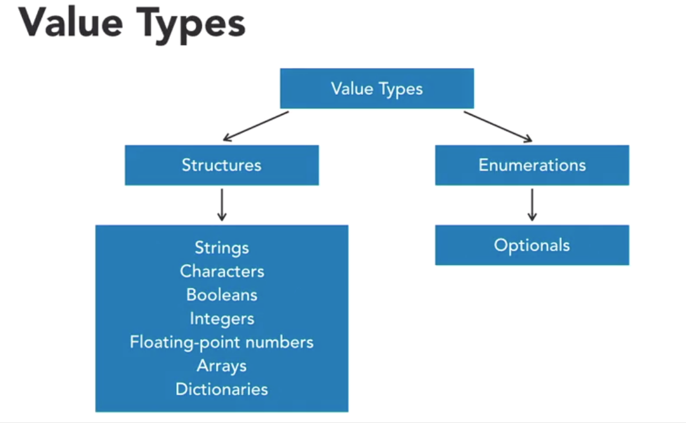
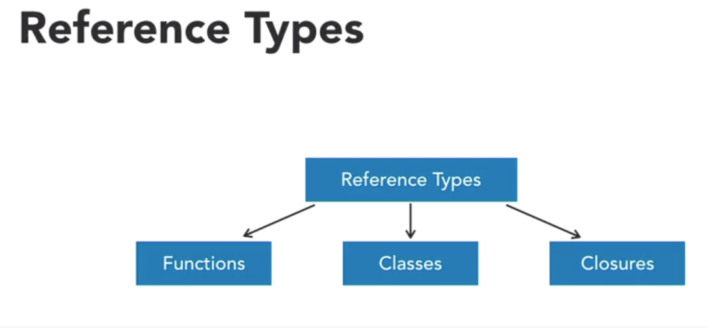

# Swift Notes 

* Swift 2.2 was made to be open sourced 

## Links 

* Their main homepage: [https://developer.apple.com/](https://developer.apple.com/)
* Documentation: [https://developer.apple.com/documentation/](https://developer.apple.com/documentation/)

## Variables 

### Value Types 



* Passing value types will be a bit for bit copy of the value 
* Any changes made to the copy of the value, won't affect the skeleton one 

### Reference Types 



* Passing by reference will make modifications to the original one, since all interactions will be with the original copy


### Choosing the Right Type 

* **Structs** - simple, encapsulated object needs + copied 
* **Classes** - anything needing to be passed by reference + uses inheritance 

### Variables Notes 

* Defining a variable 
	`var life = 100` 
* Defining a constant 
	`let maxHP = 100`
* You can declare multiple variables on a line 
	`var hp = 100, life = 3, maxHP = 100`


#### Assigning Variable Types 

* Swift is a type safe language -- aka, you have to declare the type of the variable so that the compiler can catch compiler errors 
* **Inferred** - swift seems generally smart enough to be able to infer the type of a variable when you are defining it and it won't allow other variable types to be assigned to that variable later on 
* **Explicit** - you can explicitly define the type of a variable, in the case where it's not super clear 

```swift
var inventorySlots_explicit: Int 
inventorySlots_explicit = 15

// defining the value can also be on the same line
var equipmentSlots_superExplicit: Double = 5.5

// can define multiple explicit types on the same line 
var gold, mana, skillPoints: Int
gold = 3 
```

## Operators 


